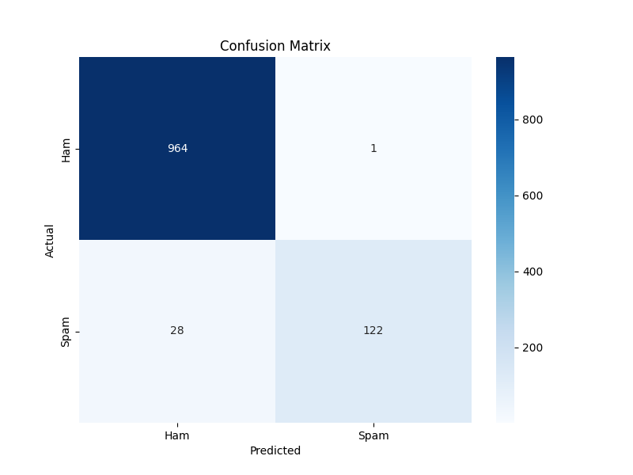

# 📩 SMS Spam Classifier

*A Machine Learning powered web app to detect spam messages, built with Flask & Scikit-learn*



# output


# model accuracy 


## 🚀 Overview

This project is a **Spam Detection System** that uses **Natural Language Processing (NLP)** and **Machine Learning** to classify SMS messages as **Spam** or **Ham (Not Spam)**.
It comes with:

* **Flask web interface** for easy message testing.
* **Command-line interface (CLI)** for terminal usage.
* **Interactive results** showing prediction confidence, top contributing words, and spam indicators.

---

## ✨ Features

✅ Web-based & CLI support  
✅ Message preprocessing (stopwords removal, punctuation cleaning)  
✅ TF-IDF vectorization for text features  
✅ Multinomial Naive Bayes model for classification  
✅ Confidence scores for spam & ham predictions  
✅ Highlighting spam indicators:
* Presence of URLs
* Special character count
* High digit count  

✅ Confusion matrix visualization  

---

## 📂 Project Structure

```

sms-spam-classifier/
│
├── .venv/                     # Virtual environment folder
│   ├── Include/
│   ├── Lib/
│   ├── Scripts/
│   └── pyvenv.cfg
│
├── .gitignore                  # Git ignore file
├── README.md                   # Project documentation
├── requirements.txt            # Python dependencies
│
├── data/                       # Dataset and trained models
│   ├── sms\_spam.csv            # Dataset file
│   └── models/
│       ├── spam\_classifier.pkl     # Trained model
│       └── tfidf\_vectorizer.pkl    # TF-IDF vectorizer
│
├── notebooks/                  # Jupyter notebooks
│   └── EDA.ipynb                # Exploratory Data Analysis
│
├── src/                        # Source code
│   ├── **pycache**/
│   ├── app.py                   # Flask web app
│   ├── predict\_cli.py           # CLI prediction script
│   └── train\_model.py           # Model training script
│
├── static/                     # Static files (images, CSS, JS)
│   └── confusion\_matrix.png     # Model performance visualization
│
└── templates/                   # HTML templates
└── index.html               # Frontend page

````

---

### 2️⃣ Install dependencies

```bash
pip install -r requirements.txt
````

### 3️⃣ Download NLTK stopwords

```python
import nltk
nltk.download('stopwords')
```

### 4️⃣ Train the models

```bash
python train_model.py
```

### 5️⃣ Run the Flask web app

```bash
python app.py
```

Open your browser at **`http://127.0.0.1:5000`**

---

## 💻 Usage

### **Web Interface**

1. Open the web app in your browser.
2. Type your SMS message.
3. Click **Check**.
4. View results with confidence scores and reasons.

### **Command-Line Interface**

```bash
python predict_cli.py
```

Example:

```
Enter an SMS message: Win a free iPhone! Visit www.example.com now!
=== Prediction Result ===
Prediction: SPAM
Confidence: Spam (98.45%), Ham (1.55%)
Reasons:
- Top contributing words: win, free, visit
- Contains URL (common in spam)
```

---

## 📊 Model Details

* **Algorithm:** Multinomial Naive Bayes
* **Vectorization:** TF-IDF (max features: 3000, bigrams included)
* **Dataset:** SMS Spam Collection Dataset
* **Accuracy:** \~97% on test set

---

## 📦 Requirements

* Python 3.7+
* Flask
* scikit-learn
* pandas
* numpy
* nltk
* seaborn
* matplotlib
* joblib

Install all with:

```bash
pip install -r requirements.txt
```

---

## 🔮 Future Improvements

* Deploy on **Heroku / Render** for live usage
* Add API endpoints for integration with other apps
* Support for multiple languages
* Deep learning model for improved accuracy

---

* Dataset: [UCI SMS Spam Collection](https://archive.ics.uci.edu/ml/datasets/sms+spam+collection)
* Libraries: Flask, Scikit-learn, NLTK, Pandas, Matplotlib, Seaborn

```


Agar tum chaho to main isme **table of contents** bhi add kar sakta hoon taaki README scroll karna easy ho jaye.
```

